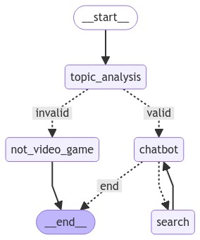

# Video Game Bot

Welcome to the Video Game Bot! This bot is designed to answer queries related to video games. It is built using LangGraph, Google Gemini, Groq, Tavily APIs, and the frontend is developed using Streamlit.

## Graph Visualization

## Features

- Provides information and answers queries related to video games.
- Utilizes LangGraph for natural language processing.
- Integrates with Google Gemini LLM for answering the query.
- Utilizes Groq for verifying the query.
- Tavily APIs are used for accessing web search.
- The frontend is developed using Streamlit for a user-friendly interface.

## Deployment

To deploy the Video Game Bot, follow these steps:

1. Clone the repository to your local machine.
2. Install the required dependencies by running `pip install -r requirements.txt`.
3. Obtain API keys for LangGraph, Google Gemini, Groq, and Tavily.
5. Add the following environment variables to the `.streamlit/secrets.example.toml` file:
    - `GOOGLE_GEMINI_API_KEY=<your_google_gemini_api_key>`
    - `GROQ_API_KEY=<your_groq_api_key>`
    - `TAVILY_API_KEY=<your_tavily_api_key>`
6. Rename the `.streamlit/secrets.example.toml` to `.streamlit/secrets.toml` file.
7. Run the application using `streamlit run main.py`.
8. Access the Video Game Bot through your browser at `http://localhost:8501`.

Please ensure that you keep your API keys secure and do not share them publicly.
